# Percepio Demos
This repository provides a set of demos for [Percepio Tracealyzer](https://percepio.com/tracealyzer) and [Percepio Detect](https://percepio.com/detect).

Runnable demo projects are provided for the following boards and development tools:
* [STMicroelectronics B-L475E-IOT01A1 (Arm Cortex-M4) using IAR Embedded Workbench](https://github.com/percepio/demos/tree/main/STM32CubeDemos-B-L475E-IOT01A/Projects/EWARM)
* [STMicroelectronics B-L475E-IOT01A1 (Arm Cortex-M4) using STM32CubeIDE](https://github.com/percepio/demos/tree/main/STM32CubeDemos-B-L475E-IOT01A/Projects/STM32CubeIDE)
* [Microchip PIC32CK-SG01 (Arm Cortex-M33) with MPLAB X IDE](https://github.com/percepio/demos/tree/main/PIC32CK-SG01)

This repository also provides [Usage Examples](https://github.com/percepio/demos/tree/main/UsageExamples) with documentation (this document) that should be helpful also without having one of the demo boards available. 

## What is Percepio Tracealyzer?
Tracealyzer is an advanced visualization tool for embedded software traces, generated by the TraceRecorder tracing library. Tracealyzer also support other trace formats, but most RTOS integrations rely on TraceRecorder.

Tracealyzer provides a graphical timeline showing thread execution, interrupt handlers, kernel API calls and custom user event logging in your code. Other views provide various analytics for profiling and for finding anomalies in the trace, such as CPU load graphs, stack and heap memory usage graphs and timing plots. This supports continouous live streaming as well as in-memory tracing (snapshots). 


The Percepio TraceRecorder library is open source (Apache 2.0) and includes kernel tracing support for several popular RTOSes such as FreeRTOS, Zephyr, ThreadX, and also offers a rich set of logging features for data plots, state machines, runnables etc. It is designed for 32-bit microcontrollers with limited memory and scales up to 64-bit multicore SoCs.

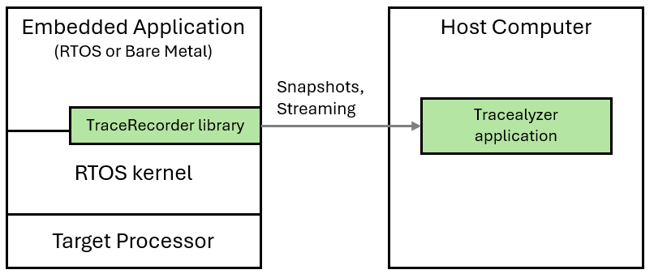

## What is Percepio Detect?
Demos are also included for the related solution [Percepio Detect](https://percepio.com/detect), offering automated observability across multiple devices on crashes, abnormal behavior and runtime risks. Detect can be used throughout development, testing, in field trials and even in deployed operation.

With Detect you can:
* Solve bugs occurring outside your debugging environment
* Detect hidden risks early (e.g. if close to a watchdog reset)
* Monitor runtime metrics over unlimited time - even in the field also in the field while providing trace data (only) at anomalies
* Capture trace snapshots at specific conditions or events, providing most recent RTOS activity and log messages
* Get core dumps on fault exceptions or other events, showing the call stack, arguments and variable values

This lets you avoid many hours of painful issue reproduction and catch potential issues early, before they become cryptic errors. 

Percepio Detect runs in your own private network using Docker, without relying on external cloud services. 

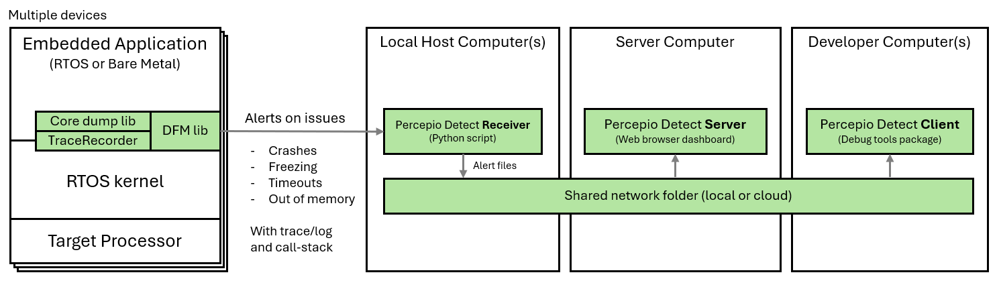

The Detect Server provides a shared web browser dashboard for your team, with easy access to debugging views. Debugging tools such as Tracealyzer and a Core Dump Viewer are integrated in the Detect Client.

Percepio Detect currently supports Arm Cortex-M based devices with FreeRTOS (or bare metal). Zephyr support is coming soon.

Learn more about Percepio Detect in the [Detect section further down](#percepio-detect).

## TraceRecorder demos
The following demos demonstrate TraceRecorder tracing with FreeRTOS, using the RingBuffer setup. They run in sequence and progress is displayed in the console. 

To view the demo console log:

* If using STM32CubeIDE or MPLAB X IDE, connect with a serial terminal application to the board's COM port. The default board rate is 115200 baud.

* If using IAR Embedded Workbench, the printf log is displayed in the Terminal I/O window, found in the View menu when in Debug mode. Make sure to enable printf redirection to SWO, found under Options -> General Options -> Library Configuration. In the "Library low-level interface implementation" panel, select "Semihosted" and "Via SWO".

### Tracing RTOS threads
Source code: [UsageExamples/01_tracerecorder_kernel_tracing.c](UsageExamples/01_tracerecorder_kernel_tracing.c).

This demo shows RTOS kernel tracing with Percepio TraceRecorder. Three threads are created, that are using a queue and a mutex. The thread-level execution is traced automatically. No logging calls are needed in the application code. 

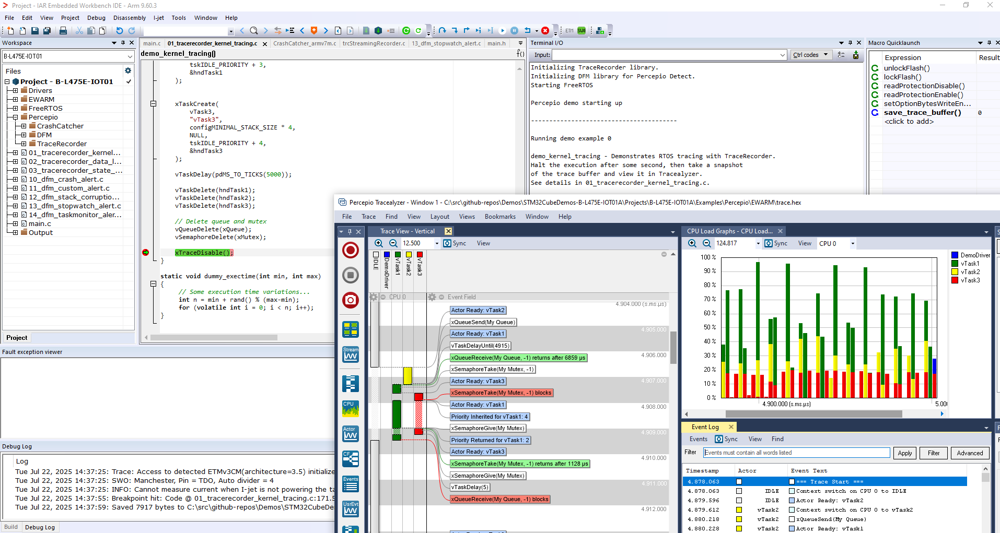

Once this demo has started, halt the execution after a few seconds, before the next demo starts. Alternatively, you can put a breakpoint at xTraceDisable call at the end of the file.

To view the resulting trace, save a snapshot as [described here](https://github.com/percepio/demos/blob/main/README.md#using-tracealyzer-to-view-snapshot-traces-from-tracerecorder), and open the resulting file in your Tracealyzer application (File -> Open -> Open File). 

In the trace view you can now see the execution of the three tasks, including kernel API calls on the Mutex and Semaphore objects as floating event labels. The red labels show blocking events, for example when the high priority task is forced to wait for the Mutex to become available. The blocked time is displayed by a crosshatched pattern. Learn more about the trace visualization in the User Manual (Help menu -> Views -> Trace View).

Note that the queue and mutex objects have been given custom object names as [described here](https://percepio.com/naming-your-kernel-objects/). 

If you are curious how it works, the RTOS kernel contains various trace hooks at important events. TraceRecorder defines these hooks to call its event tracing functions on key events such as task-switches and kernel API calls. The overhead of this is very small and typically not noticable.

To set up TraceRecorder in your own project, make sure to follow the [integration guide](https://percepio.com/getstarted/latest/html/) matching your RTOS.

### Logging Application Data in TraceRecorder
Source code: [UsageExamples/02_tracerecorder_data_logging.c](UsageExamples/02_tracerecorder_data_logging.c).

This example demonstrates the use of TraceRecorder "user events" for debug logging and logging of variable values using the [trcPrint.h API](https://github.com/percepio/TraceRecorderSource/blob/main/include/trcPrint.h). This API is accessed by including trcRecorder.h. 

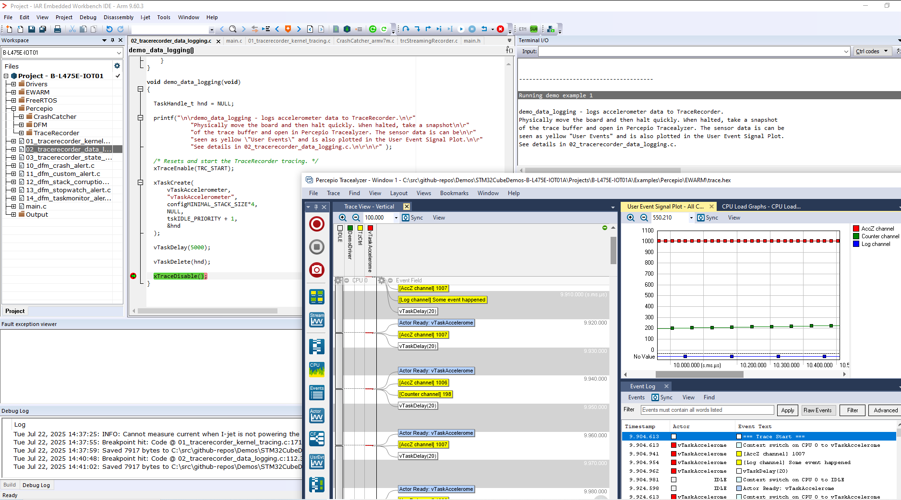

TraceRecorder user events can be a superior alternative to printf calls in many cases, as printf calls can be very slow (milliseconds per call). When used for "printf debugging", this level of logging overhead may affect the debugged system in unpredictable ways and might give misleading results. TraceRecorder user events can be hundreds of times faster than a printf over a UART and thus eliminate over 99% of the logging overhead. See [this blog post](https://percepio.com/tracealyzer/ultra-fast-logging/)) for a performance comparison.

Once this demo has started, halt the execution after a few seconds, before the next demo starts. Alternatively, you can put a breakpoint at xTraceDisable call at the end of the file.

To view the resulting trace, save a snapshot as [described here](https://github.com/percepio/demos/blob/main/README.md#using-tracealyzer-to-view-snapshot-traces-from-tracerecorder), and open the resulting file in your Tracealyzer application (File -> Open -> Open File). 

The logged "user events" are displayed as yellow labels in the trace view, and also appear in the event log. With Percepio Tracealyzer you can also see a plot of user event data arguments in the User Event Signal Plot. If this is not displayed automatically it is found in the Views menu.

### Logging State Variables in in TraceRecorder
Source code: [UsageExamples/03_tracerecorder_state_logging.c](UsageExamples/03_tracerecorder_state_logging.c).

Demonstrates loggning of state changes with Percepio TraceRecorder using the [trcStateMachine.h API](https://github.com/percepio/TraceRecorderSource/blob/main/include/trcStateMachine.h) functions. Note that Percepio Tracealyzer is needed to visualize these events.

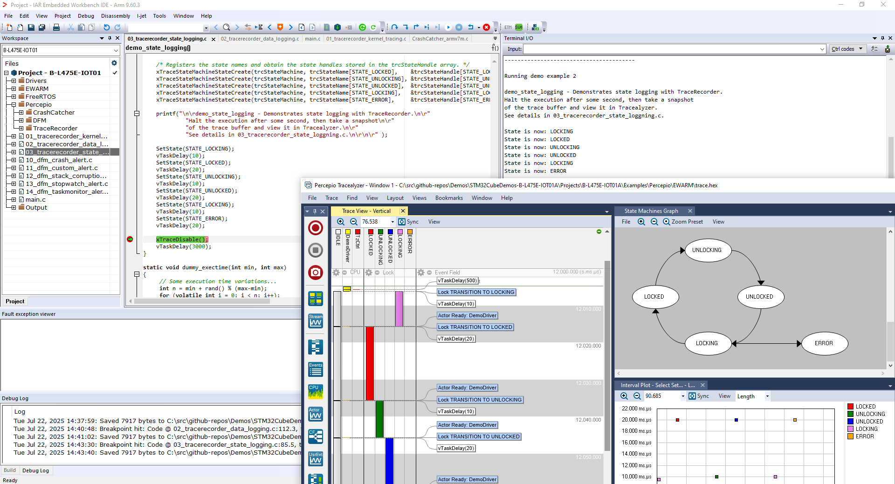

Once this demo has started, halt the execution after a few seconds, before the next demo starts. Alternatively, you can put a breakpoint at xTraceDisable call at the end of the file.

To view the resulting trace, save a snapshot as [described here](https://github.com/percepio/demos/blob/main/README.md#using-tracealyzer-to-view-snapshot-traces-from-tracerecorder), and open the resulting file in your Tracealyzer application (File -> Open -> Open File). 

With Percepio Tracealyzer, the logged states are displayed in the Trace View, with one View Field per state machine object. You may expand and collapse such View Field using the small (-) or (+) icons in the top (next to the "gear" icon). You can see a state diagram for the logged states by selecting Views -> State Machine Graph. Moreover, double-clicking on a state interval opens a new window with additional information, such as timing statistics.

## Using Tracealyzer to view snapshot traces from TraceRecorder
TraceRecorder support multiple ways of transmitting the data, both live streaming and by snapshots. These demos are configured for snapshots, meaning the trace data is stored to a target-side RAM buffer, typically in ring-buffer mode where older data is overwritten once the buffer becomes full. To read out the trace data, snapshots of trace buffer can be saved in two main ways. 
* When Tracealyzer is used stand-alone, snapshots are typically saved using the debugger connection, as described below.
* In Percepio Detect, TraceRecorder snapshots are saved by the DFM library and transmitted to the host computer as part of an "alert", for example using the serial port or ITM/SWO.

Trace streaming is not covered by these demos yet. For more information about streaming, please refer to the [integration guide](https://percepio.com/getstarted/latest/html/) and in the User Manual included with the tool (search for "Streaming").

### TraceRecorder Snapshots using GCC-based tools
* Start a debug session in your IDE and open the debug console, or launch a gdb session from the command line.
* Halt the execution sometime after the xTraceEnable call (e.g. at a breakpoint).
  - If using an Eclipse-based IDE, or using gdb directly from the command line, run the following command:
  ```
  dump binary value trace.bin *RecorderDataPtr
  ```
  - If using VS Code, you need to add ‘-exec’ before the gdb command, like this:
  ```
  -exec dump binary value trace.bin *RecorderDataPtr
  ```
* The resulting "trace.bin" is typically found in the project folder. Open trace.bin in your Tracealyzer application by selecting ‘File –> Open –> Open File’ or, if using Windows, you can drag and drop the file to your Tracealyzer application.

* For more frequent use, you can configure your Tracealyzer application to automate the GDB trace capture, using the “Take Snapshot” option. For setup instructions, see “Using the Tracealyzer GDB integration” at https://percepio.com/tracealyzer/gettingstarted/snapshots-eclipse-gdb/.

### TraceRecorder Snapshots using IAR Embedded Workbench
Locate `save_trace_buffer.mac` in the EWARM project folder. This IAR macro file will save the contents of the trace buffer to a host file.

* Add the macro file under Options -> Debugger -> Use Macro File(s).
* When in a debug session, open View -> Macros -> Debugger Macros and look for “save_trace_buffer”.
  - In the “Debugger Macros” view, right-click on your macro and select “Add to Quicklaunch window”. 
  - Double-click on the “refresh” icon in the Quicklaunch window to save the trace.

See also https://percepio.com/tracealyzer/gettingstarted/iar/.

### TraceRecorder Snapshots using MPLAB X IDE
To capture snapshot traces in MPLAB projects, it is recommended to use the [Percepio Trace Exporter plugin](https://percepio.com/tracealyzer/microchip/). Instructions are found at the linked page.


## Percepio Detect
[Percepio Detect]() focuses on reporting anomalies, such a crashes, faults and other signs of abnormal runtime behavior. The data is provided by C library that is integrated on the device, DFM, which stands for Device Firmware Monitor. 


The reported data is ingested by the Detect Server, where it is stored in a database and presented in a web browser dashboard. This is designed to run locally, on prem, but can also be deployed in your own cloud assuming some customizations.

A web-browser dashboard provides a summary of the reported issues across all devices and tests. This includes debugging information such as TraceRecorder traces (snapshots) and core dumps, easily accessible via the "payload" links on the dashboard.

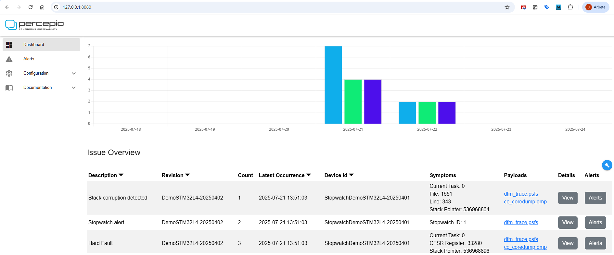

To get started with Detect, sign up for a [free 30 day evaluation](https://percepio.com/download-detect-eval/).

### Demonstrated Features

DFM alerts are machine-readable error reports, containing metadata about the issue and debug data captured at the error, including a small core dump
with the call-stack trace, as well as a TraceRecorder trace providing the  most recent events. DFM provides several methods to detect system anomalies and generate alerts, both automated methods and an API for custom alerts.

* **Fault Exceptions** (hard faults etc.) are captured and reported automatically using an integrated fault exception handler. This is designed for Arm Cortex-M devices. Support for other processor architectures is planned in the upcoming Zephyr support.

* The **Stopwatch** feature lets you monitor the response time (latency) of a code section and get alerts if a set warning level is exceeded. This also keeps a high watermark that avoids repeated alerts, that are below the previous high watermark. The high watermark can also be useful for profiling over long time periods, and for setting appropriate warning levels. This also allows for capturing elusive bugs as anomalies in response time/latency, for example thread starvations, deadlocks or priority inversions.
  
* The **TaskMonitor** allows for monitoring the CPU time usage per thread. An alert is produced if a monitored thread is outside the specified range, for example if stuck in a loop or if the thread runs less than expected. This also allows for capturing elusive bugs by their side-effect on CPU time usage, for example thread starvation, deadlocks and priority inversions. The TaskMonitor provides high and low watermarks for each thread. To avoid repeated redudant alerts, alerts are only emitted if the thread CPU usage is outside the watermark range. The watermarks are also useful for tuning the expected range/warning levels. The checks are done in xTraceTaskMonitorPoll() function, that should be called periodically. 

* **Stack corruption** is also reported, assuming stack integrity checking is enabled in the compiler settings. This allows for capturing stack smashing attacks and buffer overrun bugs. This works with (at least) gcc, clang and IAR.
  
* **Custom alerts** can be generated from your code, e.g. in error handlers and Assert statements, using the DFM API. The easiest way is to use the DFM_TRAP() macro but you may also compose your own custom alert using the dfmAlert functions.

### Transmitting Alerts to Percepio Detect
The DFM library can output the alert data in multiple ways using different output modules. The data is typically received by a host computer, where the Detect Receiver tool loads the data into the Detect storage.

Two output modules are included in this demo repository:
* [Serial](https://github.com/percepio/demos/tree/main/PercepioLibs/DFM/cloudports/Serial): Textual data dumps via printf to the regular debug console.
* [ITM](https://github.com/percepio/demos/tree/main/PercepioLibs/DFM/cloudports/ITM): Raw binary output using the ITM unit, typically on the SWO pin.
  
You may define your own output module to implement a customized data transfer. For example, for cloud-connected devices, DFM can send the alerts directly to your cloud using e.g. MQTT.

#### Using the debug console
The [Serial](https://github.com/percepio/demos/tree/main/PercepioLibs/DFM/cloudports/Serial) module writes the DFM alert data as as hexadecimal strings to the debug console, i.e. where your printf calls go. This can be mixed with other system logging. The resulting log file needs to be processed by the Percepio Receiver tool, that extracts the DFM data and stores it as alert files in the shared alert directory, where they are noticed and ingested by the Detect Server. 

Most serial terminal applications allow for logging the output to a file. You simply pass this log file as argument to the Percepio Receiver tool.

Learn more about the Receiver tool in the readme file in the tool directory (percepio-receiver/readme-receiver.txt).

#### Using ITM/SWO with IAR Embedded Workbench
For Arm Cortex-M devices featuring the ITM unit, the [ITM](https://github.com/percepio/demos/tree/main/PercepioLibs/DFM/cloudports/ITM) module can offer faster transmission of the DFM data. The data is then transferred over the SWO pin on the debug port, saved to a (binary) log file by the debugger, which is then passed to a Detect receiver script for ingestion.

This works best with a fast debug probe supporting high-speed SWO in Manchester mode, such as IAR's I-Jet probe, and that the ITM data can be logged to file reliably, which is also supported by IAR. This is therefore the recommended method for IAR users.

To configure this in IAR Embedded Workbench, first make sure the I-Jet is configured for Manchester mode, if available. This is necessary to achieve high SWO speeds. Open the Options page and the I-Jet page. On the Trace page, you find the "SWO protocol" setting. Make sure this is set to "Manchester" (or "Auto").

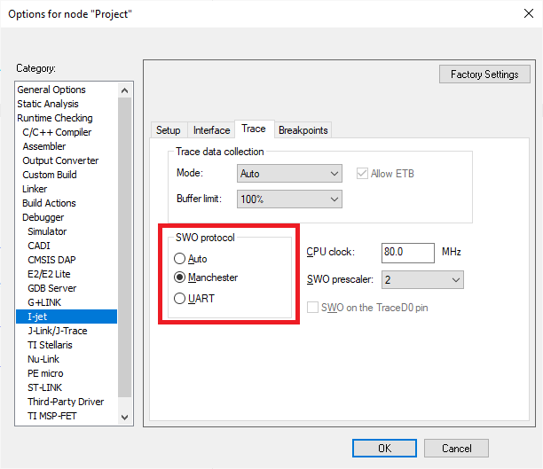

Next, start a debug session and open "SWO Configuration". Enable ITM port 2 both under "Enabled ports" and under "To Log File" (the third checkboxs from the right). 

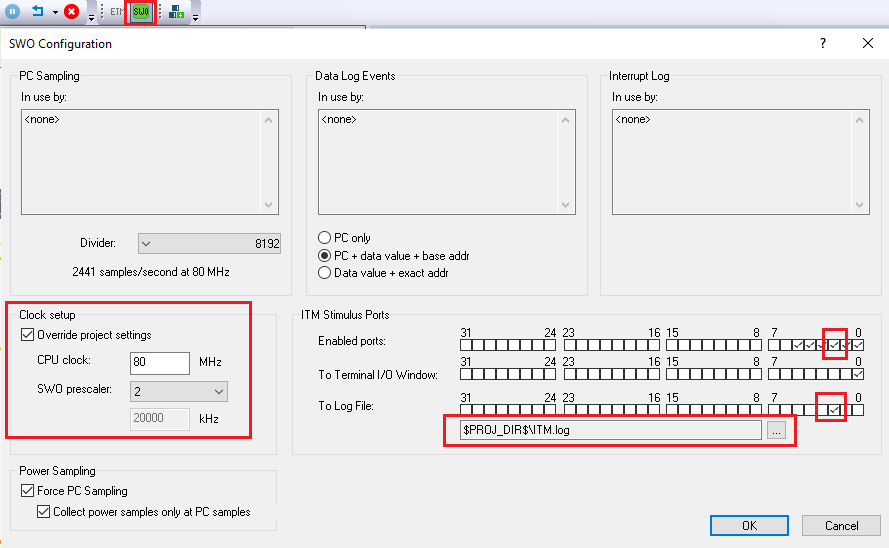

While the transfer speed is not critical for Percepio Detect, fast data transfer is still preferrable and the data transfer must be 100% reliable.
It is therefore adviced to adjust the SWO prescaler, that decides the SWO clock frequency. In our experience, the "auto" option may result in too high SWO clock frequency, resulting in occational transfer errors. Up to 20 MHz SWO seems to work well with I-Jet probes, but 40 MHz caused corrupted output.

By default, DFM uses ITM port 2. You may change the ITM port setting in dfmCloudPortConfig.h to avoid conflicts with other iTM logging in your system.

To process the ITM log, use the python script "bin2alerts.py" found in the Percepio Receiver directory.
A usage example is given below:
```
python.exe .\bin2alerts.py path\to\ITM.log -f ..\test-data\alert-files\ -d DemoDevice42 --eof wait
```
The arguments have the following meaning:
* -f path: The destination directory for the alert files, that should match the Alert directory of the Detect Server.
* -d name: Allows for overriding the device name reported by DFM, if the device name is not defined in the DFM integration.
* --eof wait: Makes the script await more data when reaching the end of the file. Use this mode to run the script in real time during the testing. To quit the script, use Ctrl-C in the terminal. If omitted, the script will exit when reaching the end of the file.

Once the resulting alert files have been written to the Alert directory, they should appear in the Detect dashboard within a few seconds.

#### Other output methods
The examples in this repository use direct output at the point of detection. This is easiest to begin with and often sufficient for inhouse testing. However, it is also possible to use deferred output, meaning that the alert data is temporarily stored on the device and sent on a later point. For example, after the device has restarted and is fully functional. This is a key enabler for field use, where you typically want to use more advanced interfaces such as MQTT or secure sockets that are hard to use in processor fault handlers.

DFM also allows for use in fielded offline devices. This by storing the DFM data on the device, e.g. on a flash file system, and uploading the data via a host device, like a laptop or smartphone, when this is connected.


## Percepio Detect Demos

The first step to get started with Detect is to [sign up for evaluation](https://percepio.com/download-detect-eval/). This will provide a download link to the software package and evaluation licenses valid for 30 days. Follow the demo guide PDF provided in the Detect package.

Before you can view the debugging data from these examples, the Percepio Detect Client must be running in the background and have some paths configured to match your project. The Detect Client is an integrated package of debugging tools for Percepio Detect alerts, including Percepio Tracealyzer and a core dump viewer. The Client runs on your local computer and is accessed throught the web browser, using the payload links in the Detect dashboard. 

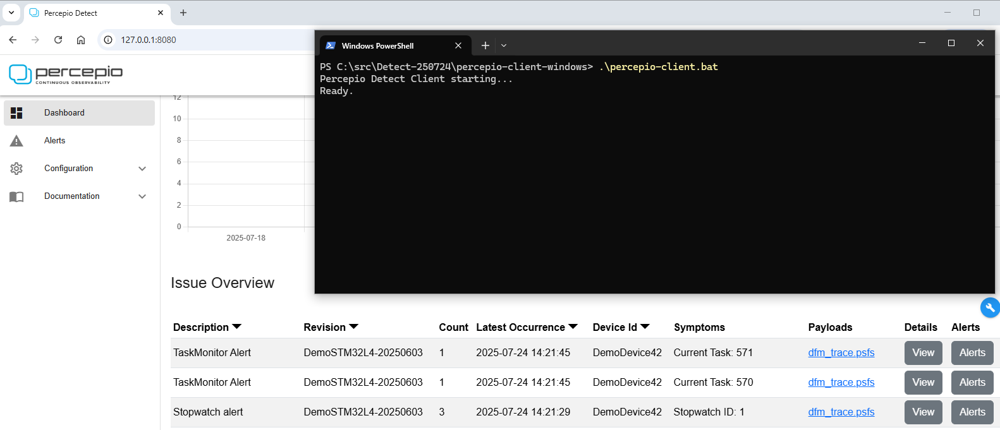

Follow these steps to verify and update the Client configuration:

* If using the Windows: Open percepio-client-windows/project-settings.bat and update the ELF_PATH setting to point to your ELF file. For the provided IAR project, this is called "Project.out" and found in the EWARM\B-L475E-IOT01\Exe folder. Also update the SRC_PATH folder to point to the root folder of the Demo repository. Use absolute paths here.

* If using Linux: open the Client start script in a text editor (percepio-client.sh). Set ELF_DIR to the directory of the ELF file, and ELF_REL_PATH to the ELF filename. Also update the SRC_PATH folder to point to the root folder of the Demo repository. 

Now start the Percepio Client. 
* If using Windows, run percepio-client.bat.
* If using Linux, run percepio-client.sh.

In the Detect dashboard, you can now click the payload links to display the debugging data provided with the alerts.

### Crash Debugging with Percepio Detect
Source code: [UsageExamples/10_dfm_crash_alert.c](UsageExamples/10_dfm_crash_alert.c).

This example demonstrates crash debugging with Percepio Detect. The code example causes a UsageFault Exception due to a division by zero, which is reported as an alert, including a core dump that provides the function call stack, arguments and local variables at the point of the fault.

First, make sure you have [configured and started the Client](#percepio-detect-demos).

Then locate the "Hard Fault" row in the Detect dashboard and click the "cc_coredump.dmp" payload link. This will open the provided core dump in the integrated core dump viewer.

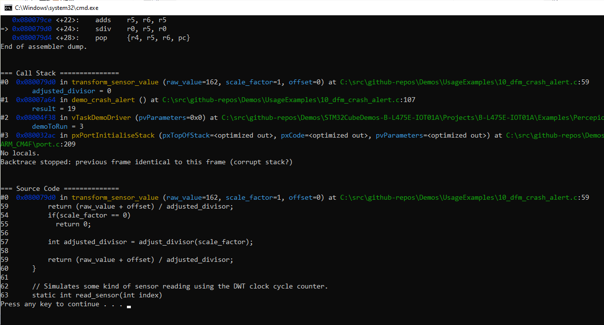

The alert also includes a TraceRecorder trace, that is accessed by clicking the "dfm_trace.psfs" payload link. This opens the trace file in the included Tracealyzer tool, bundled in the Detect Client. The trace provide more context about the task execution and previous events, leading up to the alert. This may also include user event and state logging from your application, as demonstrated in previous examples. 

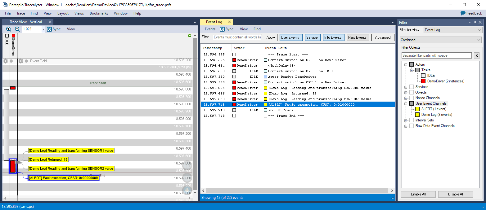

Note that Tracealyzer requires a separate license that needs to be [installed](https://percepio.com/tracealyzer/activating-license-key/) the first time you open a trace file.

### Custom Alerts with Percepio Detect
Source code: [UsageExamples/11_dfm_custom_alert.c](UsageExamples/11_dfm_custom_alert.c).

This example demonstrates programmatic error reporting using the DFM_TRAP() macro. A function is called with an invalid argument, which is detected by an initial check (could also be an Assert statement). This calls DFM_TRAP to report the error as an alert, including a core dump that provides the function call stack, arguments and local variables at the point of the fault.

Make sure you have [configured and started the Client](#percepio-detect-demos).

Locate the "Assert Failed" row in the Detect dashboard and click the "cc_coredump.dmp" payload link. This will open the provided core dump in the integrated core dump viewer.

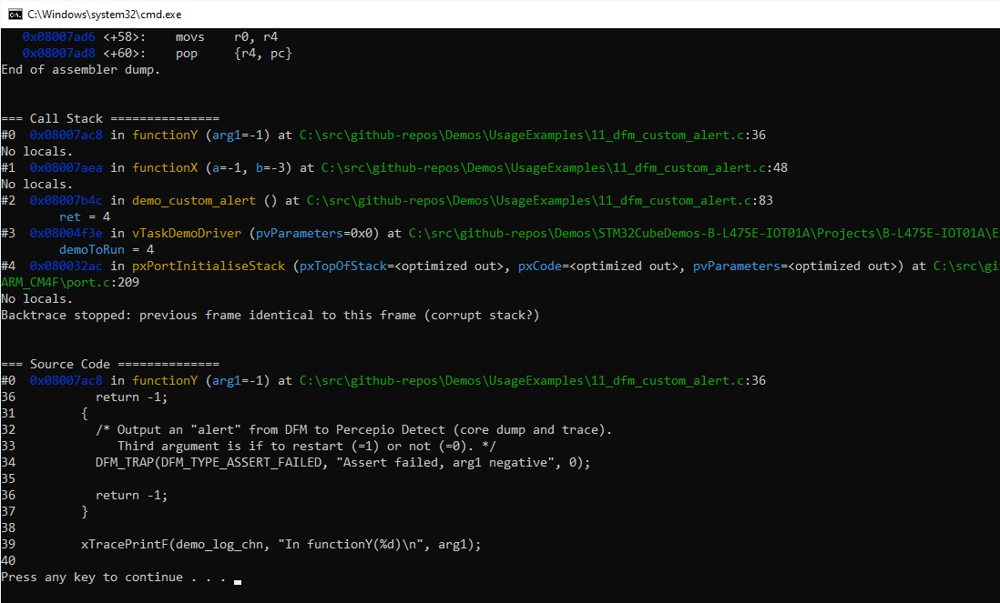

The alert also includes a TraceRecorder trace, where you can see test annotations as user events.

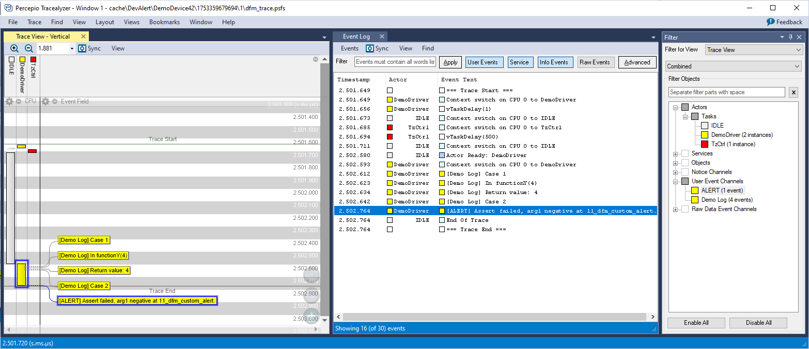

### Stack Corruption Alerts with Percepio Detect
Source code: [UsageExamples/12_dfm_stack_corruption_alert.c](UsageExamples/12_dfm_stack_corruption_alert.c).

This example shows how DFM can be used to detect stack corruption faults at an early stage, before they lead to other less obvious errors that can be a nightmare to debug. This relies on compiler features for stack integrity checking, where the compiler inserts control values on the stack (stack canaries) at certain function calls and checks them before returning from the function. If the control value has changed (i.e. due to a corrupted stack), the compiler-injected check will call an error handler in DFM that emits a "Stack Corruption" alert including a core dump and TraceRecorder trace. 

Make sure you have [configured and started the Client](#percepio-detect-demos).

Locate the "Stack Corruption" row in the Detect dashboard and click the "cc_coredump.dmp" payload link. This will open the provided core dump in the integrated core dump viewer.

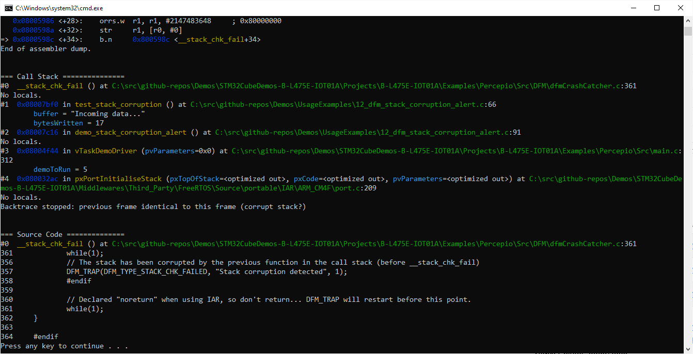

In the core dump, you will see the error handler (__stack_chk_fail) at the top of the call stack. The stack corruption was detected just before the return of the previous function (test_stack_corruption). In this case, because 17 bytes were written to a 16 byte buffer. 

A trace is also included, with user event logging showing some details from the test.

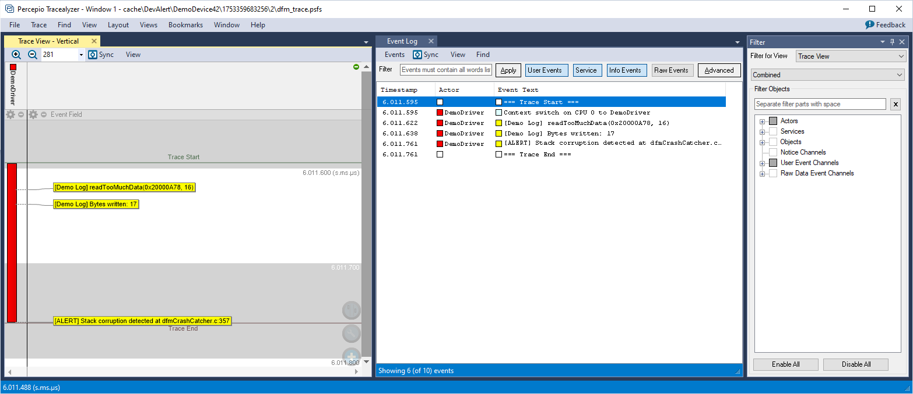

To enable this in your own project:
* If using gcc or clang, use one the [-fstack-protector](https://gcc.gnu.org/onlinedocs/gcc/Instrumentation-Options.html) compiler options. 
* If using IAR, enable "Stack protection" in project options, under C/C++ Compiler -> Code.

### Stopwatch Alerts with Percepio Detect
Source code: [UsageExamples/13_dfm_stopwatch_alert.c](UsageExamples/13_dfm_stopwatch_alert.c).

This example demonstrates how to use the DFM Stopwatch feature for detecting software latency (response time) anomalies. Alerts are provided to Percepio Detect if the latency is higher than expected, together with a trace for debugging purposes. This can be used not only to analyze execution time variations, but also for multithreading issues that otherwise might be very hard to debug.

Make sure you have [configured and started the Client](#percepio-detect-demos).

Locate the "Stopwatch Alert" row in the Detect dashboard and click the "dfm_trace.psfs" payload link. This will open the provided trace in Tracealyzer. No core dump is included, since the relevant events are in the past. 

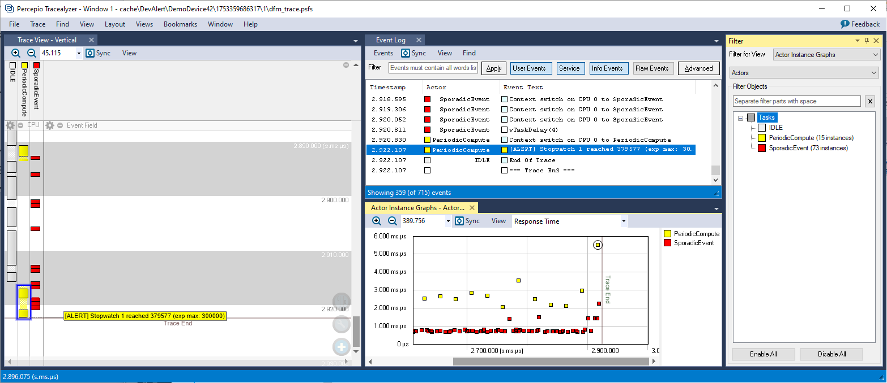

The stopwatch monitoring is inside the "PeriodicCompute" task, i.e. the yellow task in the trace. In the end of the trace, just before the alert, we can see that the "SporadicEvent" thread is preempting and running for quite a long time, causing the stopwatch to exceed the warning level.

So how does this relate to the classic timeout, offered by many RTOS services? Timeout events are typically used for faults (the call is aborted) and timeouts often have large margins to avoid premature fault handling. Stopwatches can be given tighter tolerances to capture abnormal cases that are below the timeout value, but still of interest for analysis. They can reveal undesired behaviors in your software, and might be "near misses" (close to the timeout) meaning they could potentially cause timeout errors under slighty different circumstances.

To define a specific stopwatch, call `xDfmStopwatchCreate(name, expected_max)`. This returns a `dfmStopwatch_t` pointer for use in later calls. Then use `vDfmStopwatchBegin(stopwatch_ptr)` and `vDfmStopwatchEnd(stopwatch_ptr)` to measure the time between two points in the code, including preemptions from interrupts and higher priority tasks. The highest observed value since startup is tracked as the "high watermark", that can be accessed as `stopwatch_ptr->high_watermark` or by calling `vDfmStopwatchPrintAll()`. An alert is emitted during `vDfmStopwatchEnd()` if the time since the last `vDfmStopwatchStart` exceeds `expected_max`, and also exceeds the high watermark.

Unlike TraceRecorder-based profiling, this can run indefinitely without needing to stream out, accumulate and analyze large amounts of trace data. Moreover, the Begin and End functions are normally very fast, often less than 1 µs combined, since not logging each measurement. However, the execution time of `vDfmStopwatchEnd` will be considarably longer on alerts, so it is recommended to finish any time-sensitive processing before calling `vDfmStopwatchEnd`.

You can have multiple stopwatches active in parallel. The default upper limit is 4, but this can be adjusted in dfmConfig.h (DFM_CFG_MAX_STOPWATCHES).

The time source used for Stopwatch measurements is the same as for TraceRecorder. However, DFM requires TraceRecorder to use a 32-bit free-running incrementing counter. An build error is produced if the TraceRecorder configuration is not compatible. This is the default for Arm Cortex-M devices (M3 and higher) featuring the DWT unit.

### TaskMonitor Alerts with Percepio Detect
Source code: [UsageExamples/14_dfm_taskmonitor_alert.c](UsageExamples/14_dfm_taskmonitor_alert.c).

Demonstrates the use of the DFM TaskMonitor feature for monitoring the processor time usage of software threads (RTOS threads). This is useful not only for profiling and to analyze workload variations, but also capturing multithreading issues that otherwise might be very hard to debug. For example, if the system
becomes unresponsive because of threads being blocked or deadlocked, it can be detected as the CPU usage of those threads will be outside the expected range.

Unlike TraceRecorder-based profiling, this can run indefinitely without needing to stream out, accumulate and analyze large amounts of trace data.

Make sure you have [configured and started the Client](#percepio-detect-demos).

Locate the TaskMonitor alerts in the Detect dashboard and click the "dfm_trace.psfs" payload link. This will open the provided trace in Tracealyzer. No core dumps are included, since the relevant events are in the past. 

The TaskMonitor demo includes two alerts, where the first is caused by `vTask2` running more than expected, so it exceeds the upper bound of the expected processor time usage. 

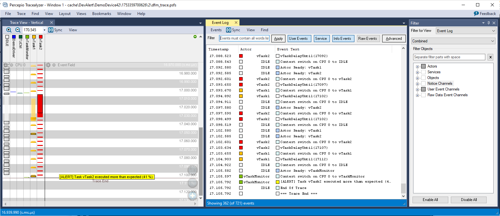

The second alert is caused when `vTask1` stops executing, so the processor usage falls below the lower bound. 

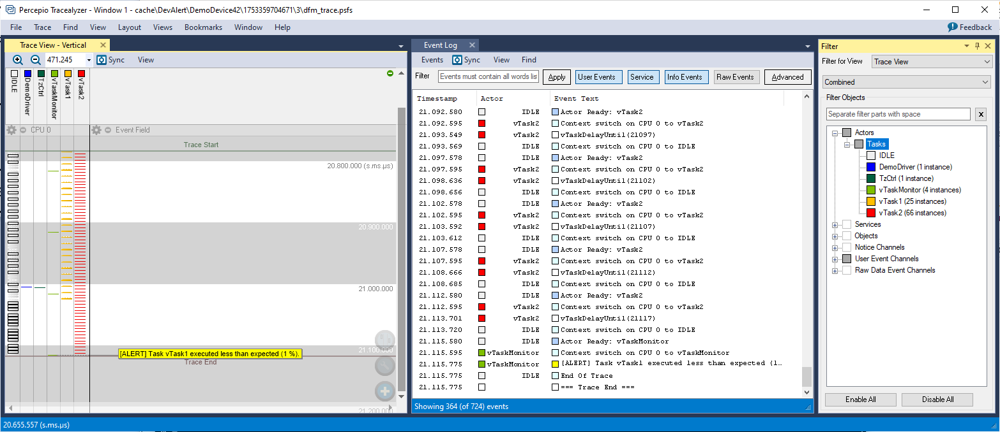

The monitoring is done by periodic calls to `xTraceTaskMonitorPoll()`. This calculates the relative processor time usage since the previous `xTraceTaskMonitorPoll()` call and compares it as a percentage of the total elapsed time between polls. The `xTraceTaskMonitorPoll()` calls are done in the `vTaskMonitor` task (green). This task is not part of the DFM library, but specific for this demo. 

To use the TaskMonitor feature, you need add periodic xTraceTaskMonitorPoll calls in a similar way, e.g. in a periodic task or in a timer callback. It is not recommended to call xTraceTaskMonitorPoll from a periodic interrupt, since the execution time when generating alerts can be relatively high, depending on the DFM configuration.

The expected range of CPU usage per thread is specified by calling `xDfmTaskMonitorRegister(task, low, high)` for each task you would like to monitor during the system initialization. The first argument is the handle (pointer) to the task, followed by the low and high bounds in percent. An example is provided below:
```
xDfmTaskMonitorRegister(hndTask2, 2, 98); // Expected range: 2 - 98%.
```

The polling periods should be short enough to fit in the trace buffer, typically 50-500 ms, depending on the trace buffer size and the event rate of the tracing.

It is recommended to align the monitor polling with your periodic tasks to reduce variations due to timing effects.
For example, if you have two periodic tasks running at 5 ms and 12 ms period, a polling rate of 60 ms (or a multiple of 60) should give good alignment.
